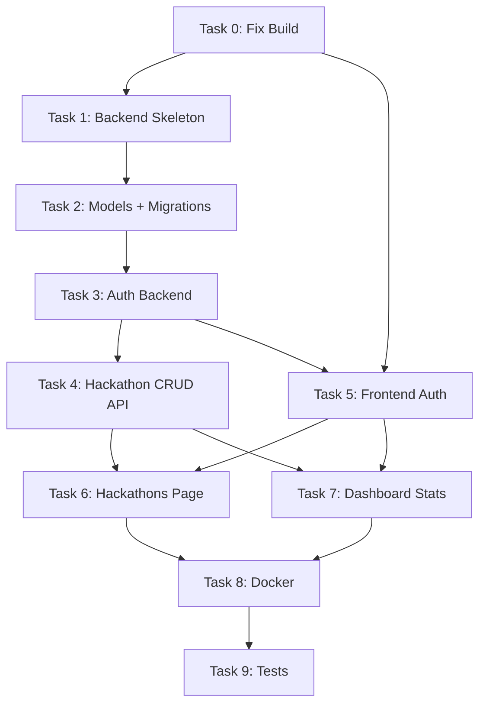

# Phase 2 Implementation Plan — Full-Stack Vertical Slice

**Baseline:** [00-repository-audit.md](file:///c:/Hackathon%20tracker/hackathon-tracker/docs/phase-2/00-repository-audit.md)  
**Goal:** Deliver the first complete full-stack vertical slice with auth, workspace, hackathon CRUD, and real data persistence.

---

## Task 0 — Fix Broken Build & Clean Up

> Unblock all subsequent work by making the existing frontend compile and pass lint cleanly.

### 0.1 Fix TypeScript build errors

**Files:**
- `tsconfig.app.json` — add `"ignoreDeprecations": "6.0"` OR remove `baseUrl` + `paths` and use an alternative (note: `paths` is still needed for `@/*` alias, so `ignoreDeprecations` is the safer fix)
- `vite.config.ts` — convert `manualChunks` from object syntax to a function, matching the Vite 8 / Rolldown API

**Acceptance criteria:**
- `npm run build` exits with code 0
- `dist/` contains valid HTML + JS + CSS bundles

### 0.2 Remove orphaned `@/` directory

**Files:**
- DELETE `@/components/ui/button.tsx`
- DELETE `@/components/ui/dialog.tsx`
- DELETE `@/components/ui/drawer.tsx`
- DELETE `@/components/ui/input.tsx`
- DELETE `@/components/ui/popover.tsx`
- DELETE `@/` directory entirely

**Dependencies:** None  
**Risk:** Low — no source file imports from this directory  
**Acceptance criteria:** Directory no longer exists; `npm run build` still passes; `npm run lint` reports 0 warnings about it

### 0.3 Fix lint warnings

**Files:**
- `src/router/index.tsx` — remove unused `Outlet` import

**Acceptance criteria:** `npm run lint` exits with 0 warnings, 0 errors

### 0.4 Initialise git repository

**Commands:**
```bash
cd hackathon-tracker
git init
git add .
git commit -m "phase-1: baseline before phase-2"
```

**Files:**
- `.gitignore` — add `.env`, `.env.local`, `__pycache__/`, `*.pyc`, `backend/venv/`, `backend/.venv/`

**Acceptance criteria:** Clean initial commit with all Phase 1 files tracked

---

## Task 1 — Backend Skeleton

> Create a FastAPI backend with async SQLAlchemy and PostgreSQL.

### 1.1 Create backend directory structure

**New files:**
```
backend/
├── app/
│   ├── __init__.py
│   ├── main.py              # FastAPI app factory, CORS, lifespan
│   ├── config.py             # Pydantic Settings (DATABASE_URL, SECRET_KEY, etc.)
│   ├── database.py           # async SQLAlchemy engine + session factory
│   ├── models/
│   │   ├── __init__.py
│   │   ├── base.py           # Base declarative model
│   │   ├── user.py           # User model
│   │   ├── workspace.py      # Workspace model
│   │   ├── hackathon.py      # Hackathon model
│   │   └── status.py         # Status model
│   ├── schemas/
│   │   ├── __init__.py
│   │   ├── auth.py           # RegisterRequest, LoginRequest, TokenResponse
│   │   ├── user.py           # UserRead, UserCreate
│   │   ├── workspace.py      # WorkspaceRead, WorkspaceCreate
│   │   ├── hackathon.py      # HackathonRead, HackathonCreate, HackathonUpdate
│   │   └── status.py         # StatusRead
│   ├── routers/
│   │   ├── __init__.py
│   │   ├── auth.py           # POST /register, POST /login
│   │   ├── users.py          # GET /me
│   │   ├── workspaces.py     # POST /workspaces, GET /workspaces
│   │   └── hackathons.py     # CRUD /workspaces/{id}/hackathons
│   ├── services/
│   │   ├── __init__.py
│   │   ├── auth_service.py   # hash/verify password, create/verify JWT
│   │   ├── user_service.py   # user queries
│   │   ├── workspace_service.py
│   │   └── hackathon_service.py
│   └── dependencies.py       # get_db, get_current_user
├── alembic/
│   ├── env.py
│   ├── script.py.mako
│   └── versions/             # auto-generated migrations
├── alembic.ini
├── requirements.txt
├── .env.example
└── Dockerfile
```

**Dependencies (requirements.txt):**
```
fastapi>=0.115
uvicorn[standard]>=0.34
sqlalchemy[asyncio]>=2.0
asyncpg>=0.30
alembic>=1.15
pydantic>=2.10
pydantic-settings>=2.7
python-jose[cryptography]>=3.3
passlib[bcrypt]>=1.7
python-multipart>=0.0.20
```

**Risk:** Async SQLAlchemy style must be established here and used consistently everywhere  
**Acceptance criteria:**
- `uvicorn backend.app.main:app` starts without errors
- `GET /docs` returns Swagger UI
- `GET /health` returns `{"status": "ok"}`

### 1.2 Configure database connection

**Files:**
- `backend/app/config.py` — reads `DATABASE_URL` from environment
- `backend/app/database.py` — creates `async_engine`, `async_sessionmaker`, `get_db` dependency

**Decision:** Use **async SQLAlchemy** throughout. Do NOT mix sync and async sessions.

**Acceptance criteria:**
- App starts and connects to PostgreSQL
- Session dependency is injectable

---

## Task 2 — Database Models & Migrations

### 2.1 Create SQLAlchemy models (Phase 2 scope only)

**Models** (mapped from `src/types/index.ts`):

| Model | Table | Key columns |
|---|---|---|
| `User` | `users` | id, name, email (unique), hashed_password, avatar_url, github_handle, linkedin_url, created_at, updated_at |
| `Workspace` | `workspaces` | id, name, owner_id (FK users), settings (JSONB), created_at, updated_at |
| `Hackathon` | `hackathons` | id, workspace_id (FK workspaces), name, website_url, description, start_date, end_date, status, location, is_online, created_at, updated_at, deleted_at |

**Risk:** `status_id` FK in TypeScript type references a `Status` entity. For Phase 2 simplicity, use a string enum column (`status`) on Hackathon instead of a separate Status table. The Status table can be introduced in Phase 3.

**Acceptance criteria:**
- Models define proper relationships and constraints
- UUIDs used for primary keys (matching frontend `ID = string`)

### 2.2 Create Alembic migrations

**Commands:**
```bash
cd backend
alembic init alembic
alembic revision --autogenerate -m "initial: users, workspaces, hackathons"
alembic upgrade head
```

**Acceptance criteria:**
- Migration creates all three tables in PostgreSQL
- `alembic upgrade head` and `alembic downgrade -1` both work

---

## Task 3 — Authentication Backend

### 3.1 Implement auth service

**Files:**
- `backend/app/services/auth_service.py`

**Functions:**
- `hash_password(plain: str) -> str` — bcrypt via passlib
- `verify_password(plain: str, hashed: str) -> bool`
- `create_access_token(data: dict) -> str` — python-jose, HS256
- `decode_access_token(token: str) -> dict`

### 3.2 Implement auth routes

**Files:**
- `backend/app/routers/auth.py`
- `backend/app/schemas/auth.py`

**Endpoints:**
| Method | Path | Description |
|---|---|---|
| `POST` | `/api/v1/auth/register` | Create user + default workspace, return token |
| `POST` | `/api/v1/auth/login` | Verify credentials, return token |

**Business logic for registration:**
1. Validate email uniqueness
2. Hash password
3. Create User
4. Create default Workspace (name: `"{user.name}'s Workspace"`)
5. Return JWT access token

**Acceptance criteria:**
- Register with email/password → 201 + token
- Register with duplicate email → 409
- Login with correct credentials → 200 + token
- Login with wrong password → 401

### 3.3 Implement current-user endpoint

**Files:**
- `backend/app/routers/users.py`
- `backend/app/dependencies.py`

**Endpoints:**
| Method | Path | Description |
|---|---|---|
| `GET` | `/api/v1/users/me` | Return current authenticated user |

**Acceptance criteria:**
- Valid token → 200 + user data
- Missing/invalid token → 401

---

## Task 4 — Hackathon CRUD API

### 4.1 Implement hackathon routes

**Files:**
- `backend/app/routers/hackathons.py`
- `backend/app/services/hackathon_service.py`
- `backend/app/schemas/hackathon.py`

**Endpoints (all workspace-scoped, all require auth):**
| Method | Path | Description |
|---|---|---|
| `GET` | `/api/v1/workspaces/{workspace_id}/hackathons` | List hackathons (exclude soft-deleted) |
| `POST` | `/api/v1/workspaces/{workspace_id}/hackathons` | Create hackathon |
| `GET` | `/api/v1/workspaces/{workspace_id}/hackathons/{id}` | Get single hackathon |
| `PATCH` | `/api/v1/workspaces/{workspace_id}/hackathons/{id}` | Update hackathon |
| `DELETE` | `/api/v1/workspaces/{workspace_id}/hackathons/{id}` | Soft-delete hackathon |

### 4.2 Dashboard statistics endpoint

**Files:**
- `backend/app/routers/workspaces.py`

**Endpoints:**
| Method | Path | Description |
|---|---|---|
| `GET` | `/api/v1/workspaces/{workspace_id}/stats` | Return aggregate stats |

**Response shape:**
```json
{
  "total_hackathons": 5,
  "active_hackathons": 2,
  "upcoming_deadlines": 3,
  "status_breakdown": { "planning": 1, "active": 2, "completed": 2 }
}
```

**Acceptance criteria:**
- All CRUD operations work via Swagger UI
- Workspace ownership is enforced (user can only access their own workspaces)
- Soft-delete sets `deleted_at`, does not remove row
- Stats reflect real data

---

## Task 5 — Frontend API Client & Auth Flow

### 5.1 Create API client

**New files:**
- `src/lib/api-client.ts` — configured fetch/axios wrapper with base URL from `VITE_API_BASE_URL`
- `src/lib/api-client.ts` — request interceptor to attach `Authorization: Bearer <token>` header
- `src/lib/api-client.ts` — response interceptor for 401 → redirect to login

**Decision:** Use native `fetch` wrapped in a thin client. Avoid adding axios unless complexity warrants it.

### 5.2 Create auth store

**New files:**
- `src/store/authStore.ts` — Zustand store with persist middleware
  - State: `token`, `user`, `isAuthenticated`, `isLoading`
  - Actions: `login()`, `register()`, `logout()`, `fetchCurrentUser()`
  - Token stored in `localStorage` via Zustand persist

### 5.3 Create auth pages

**New files:**
- `src/pages/Login.tsx` — login form (email + password) using react-hook-form + Zod
- `src/pages/Register.tsx` — registration form (name + email + password)

### 5.4 Implement protected routes

**Files:**
- `src/router/index.tsx` — add login/register routes (public), wrap authenticated routes in a guard component
- NEW `src/components/auth/ProtectedRoute.tsx` — checks auth state, redirects to `/login` if unauthenticated

### 5.5 Create environment file

**New files:**
- `src/.env.example` → `VITE_API_BASE_URL=http://localhost:8000/api/v1`
- `.env.local` (gitignored) for local development

**Acceptance criteria:**
- Unauthenticated user redirected to `/login`
- Login → store token → redirect to dashboard
- Register → auto-login → redirect to dashboard
- Logout → clear token → redirect to `/login`
- 401 response → auto-logout

---

## Task 6 — Frontend Hackathons Page

### 6.1 Implement hackathons page

**Files:**
- MODIFY `src/pages/Placeholder.tsx` — remove hackathons from placeholder usage
- NEW `src/pages/Hackathons.tsx` — real hackathon list page with:
  - Fetch hackathons from API on mount
  - Display in a table or card grid
  - Create hackathon modal/form
  - Edit hackathon inline or modal
  - Delete hackathon (soft-delete) with confirmation
  - Loading and empty states

### 6.2 Update hackathon store

**Files:**
- MODIFY `src/store/hackathonStore.ts` — add async actions that call the API client
  - `fetchHackathons(workspaceId)` — GET from API → update normalized state
  - `createHackathon(workspaceId, data)` — POST to API → add to state
  - `updateHackathon(workspaceId, id, data)` — PATCH to API → update state
  - `deleteHackathon(workspaceId, id)` — DELETE to API → remove from state

### 6.3 Update router

**Files:**
- `src/router/index.tsx` — replace `<Placeholder title="Hackathons">` with `<Hackathons />`

**Acceptance criteria:**
- Hackathons page loads data from backend
- Create, read, update, delete all work end-to-end
- Empty state shown when no hackathons exist
- Optimistic updates or loading indicators

---

## Task 7 — Dashboard Connected to Real Data

### 7.1 Implement dashboard widgets

**Files:**
- MODIFY `src/pages/Dashboard.tsx` — replace static widget placeholders with:
  - Total hackathons count (from `/stats`)
  - Active hackathons count
  - Status breakdown chart (using Recharts)
  - Upcoming deadlines list (placeholder until Deadline CRUD exists — show empty state)

**Acceptance criteria:**
- Dashboard fetches real stats from backend on mount
- Numbers update after creating/deleting hackathons
- Graceful loading and error states

---

## Task 8 — Docker & Environment

### 8.1 Docker setup

**New files:**
- `backend/Dockerfile` — Python 3.12 slim, install requirements, run uvicorn
- `docker-compose.yml` — services: `db` (postgres:16), `backend` (FastAPI), `frontend` (Vite dev or nginx)
- `.env.example` (root) — combined env var template

**Acceptance criteria:**
- `docker compose up` starts all three services
- Frontend can reach backend via configured URL
- Database data persists across restarts (volume)

---

## Task 9 — Automated Tests

### 9.1 Backend tests

**New files:**
- `backend/tests/conftest.py` — async test fixtures, test database
- `backend/tests/test_auth.py` — register, login, invalid credentials
- `backend/tests/test_hackathons.py` — CRUD operations, auth enforcement
- `backend/tests/test_stats.py` — dashboard stats endpoint

**Dependencies:** `pytest`, `pytest-asyncio`, `httpx` (for `AsyncClient`)

**Acceptance criteria:**
- `pytest backend/tests/` passes all tests
- Tests use isolated test database (SQLite async or test PostgreSQL)

### 9.2 Frontend tests

**New files:**
- `vitest.config.ts` — Vitest configuration
- `src/tests/setup.ts` — test setup (jsdom, cleanup)
- `src/store/__tests__/authStore.test.ts`
- `src/store/__tests__/hackathonStore.test.ts`
- `src/pages/__tests__/Login.test.tsx`

**Dependencies:** `vitest`, `@testing-library/react`, `@testing-library/jest-dom`, `jsdom`, `msw` (API mocking)

**package.json addition:**
```json
"test": "vitest run",
"test:watch": "vitest"
```

**Acceptance criteria:**
- `npm test` passes all tests
- Auth store tested for login/logout/token persistence
- Login page renders and submits form

### 9.3 Browser verification

**Approach:** Manual or Playwright smoke test
- Navigate to `/login` → register → redirected to dashboard
- Create a hackathon → appears in list
- Edit hackathon → changes reflected
- Delete hackathon → removed from list
- Logout → redirected to login

---

## Risk Register

| Risk | Impact | Mitigation |
|---|---|---|
| PostgreSQL not available locally | Blocks all backend work | Use Docker compose; provide SQLite fallback for tests |
| Async vs sync SQLAlchemy confusion | Runtime errors, data corruption | Establish async-only pattern in Task 1, enforce in code review |
| TypeScript 6 deprecation warnings | Build failures in CI | Apply `ignoreDeprecations` immediately in Task 0 |
| Vite 8 breaking changes | Bundle failures | Fix manualChunks in Task 0; test build after every dependency change |
| Scope creep beyond Phase 2 | Delayed delivery | Strict scope enforcement — no Teams, Projects, Kanban, etc. |
| JWT token security | Token theft via XSS | Store in memory + localStorage with short expiry; add HTTPS in production |

---

## Dependency Graph



---

## Out of Scope (Phase 3+)

The following are explicitly excluded from Phase 2:
- Teams, Team Members
- Projects, Technologies
- Kanban board / Tasks
- Submissions
- Rounds, Round Progress
- Mentors, Judges
- Search / Full-text search
- Analytics dashboard (beyond basic stats)
- Credential Vault / API Keys
- Organiser features
- Calendar integration
- Notifications system
- User profile editing
- Multi-workspace switching
